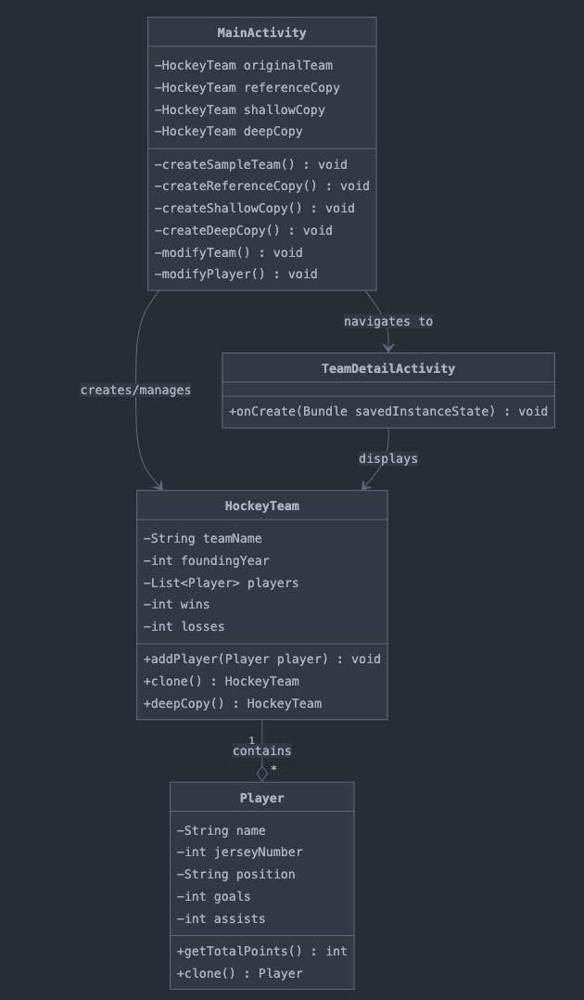

# Hockey Team Manager Implementation Guide

This document explains the implementation of the Hockey Team Manager Android app, focusing on demonstrating reference copying, shallow copying, deep copying, and anonymous classes.

## Project Structure

```
com.example.hockeyteammanager/
├── model/
│   ├── Player.java
│   └── HockeyTeam.java
├── MainActivity.java
└── TeamDetailActivity.java
```

## UML Diagram



## Key Concepts Demonstrated

### 1. Reference Copy
A reference copy simply creates another reference to the original object.
```java
HockeyTeam referenceCopy = originalTeam;
```
With reference copies, any changes to the original team or its players will affect the copy as well because they refer to the same objects in memory.

### 2. Shallow Copy
A shallow copy creates a new object but still references the same child objects.
```java
// Using the clone() method from Cloneable interface
HockeyTeam shallowCopy = originalTeam.clone();
```
With shallow copies:
- Changes to the team object itself (like team name or wins) won't affect the original
- Changes to any player objects will affect both the original and the copy since they share the same player references

### 3. Deep Copy
A deep copy creates a completely new object with new copies of all nested objects.
```java
HockeyTeam deepCopy = originalTeam.deepCopy();
```
With deep copies, changes to the original team or its players won't affect the copy at all because all objects are completely independent.

### 4. Anonymous Classes
The app demonstrates anonymous classes in several places:
```java
// Anonymous OnClickListener
button.setOnClickListener(new View.OnClickListener() {
    @Override
    public void onClick(View v) {
        // Implementation here
    }
});

// Anonymous Comparator
teams.sort(new Comparator<HockeyTeam>() {
    @Override
    public int compare(HockeyTeam team1, HockeyTeam team2) {
        return team1.getTeamName().compareTo(team2.getTeamName());
    }
});

// Anonymous Runnable
new Runnable() {
    @Override
    public void run() {
        Toast.makeText(MainActivity.this, message, Toast.LENGTH_SHORT).show();
    }
}.run();
```

## Visual Indicators

The app uses the toString() methods to display changes in the ListView:
- Team name changes for easier identification
- Wins/losses changes to demonstrate team property changes
- Player goals/assists to demonstrate nested object changes
